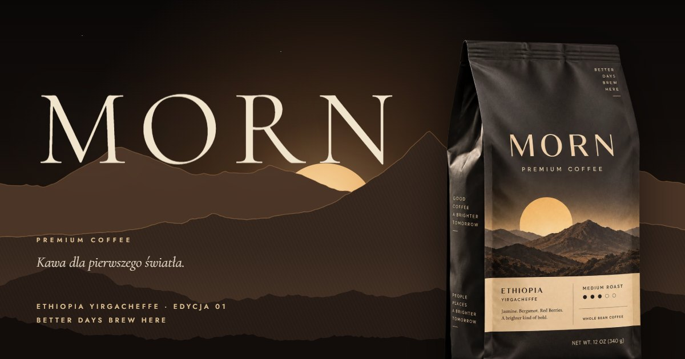

# MORN — Kawa dla pierwszego światła

**[apkmason.dev/morn](https://apkmason.dev/morn/)**

Interaktywna kampania cyfrowa fikcyjnej marki kawy premium MORN.
To nie jest klasyczny landing page, tylko jeden poranek opowiedziany scrollem. Zegar w rogu
ekranu idzie od 05:47 do zmierzchu, a słońce z opakowania wschodzi nad górami i otwiera się
w okno do filmu.



## Rozdziały

| Godzina | Rozdział         | Co się dzieje |
|---------|------------------|---------------|
| 05:47   | Przed świtem     | Loader-wschód, góry generowane w stylu grafiki z torebki, paralaksa kursora |
| 06:02   | Pierwsze światło | Słońce staje się portalem, film przewijany scrollem w kadrze kinowym, napisy i timecode |
| 06:14   | Opakowanie       | Torebka z tiltem 3D i odblaskiem, pięć zbliżeń na detale |
| 06:25   | Pochodzenie      | Profil wysokości Yirgacheffe rysowany scrollem, metryka ziarna, nuty smaku |
| 06:40   | Rytuał           | Działający 4-minutowy timer do French pressa |
| 07:15   | Dwa poranki      | Dyptyk dwóch filmów |
| 07:30   | Twój poranek     | Konfigurator, w którym zdjęcie produktu zmienia się razem z wyborem (10 wariantów), i koszyk |
| —       | Do jutra         | Zachód słońca, newsletter |

## Technika

- Statyczny HTML, CSS i JavaScript, bez procesu budowania.
- [GSAP](https://gsap.com) + ScrollTrigger oraz [Lenis](https://github.com/darkroomengineering/lenis), dołączone w `js/vendor/`.
- Fonty Cormorant Garamond i Jost hostowane lokalnie (licencja SIL Open Font License).
- Film przewijany scrollem zakodowany z krótkim GOP, osobny kadr pionowy na telefony.
- Filmy ładowane leniwie i pauzowane poza ekranem.
- Ścieżka dźwiękowa „First Light Ritual” z warstwą porannego śpiewu ptaków: domyślnie wyłączona, strumieniowana dopiero po kliknięciu „Dźwięk”.
- Obsługa `prefers-reduced-motion`, nawigacji klawiaturą i czytników ekranu, fallback do posterów.
- Koszyk i newsletter działają wyłącznie w przeglądarce. Strona nie wysyła żadnych danych.

## Uruchomienie lokalne

Strona musi być serwowana przez HTTP (nie z `file://`), a serwer musi obsługiwać
żądania Range, żeby dało się przewijać film scrollem:

```bash
npx serve .
```

## Wdrażanie zmian

GitHub Pages cache'uje pliki do 10 minut. Po zmianie CSS lub JS podbij numer wersji
w `index.html` (`main.css?v=…`, `main.js?v=…`), żeby odwiedzający od razu dostali nowe pliki.

## Struktura

```
index.html
css/        style i deklaracje fontów
js/         logika strony + biblioteki w vendor/
assets/     obrazy, filmy, dźwięk, fonty
```

---

MORN jest marką fikcyjną, a strona to projekt koncepcyjny.
